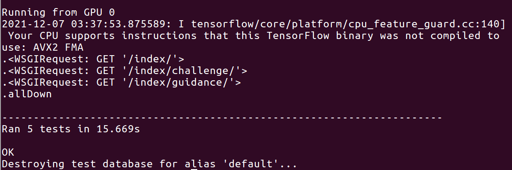
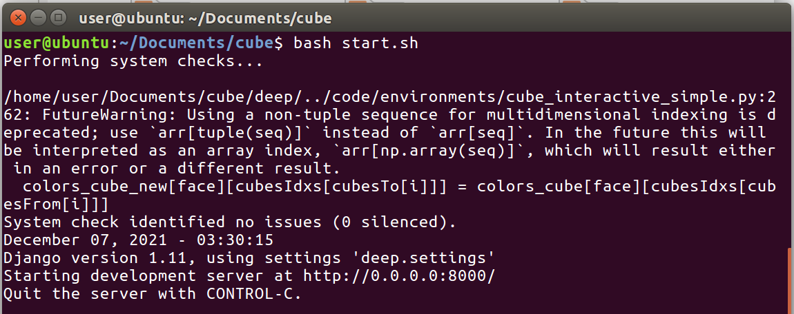
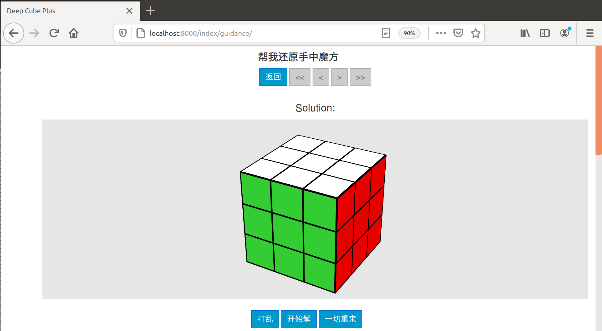
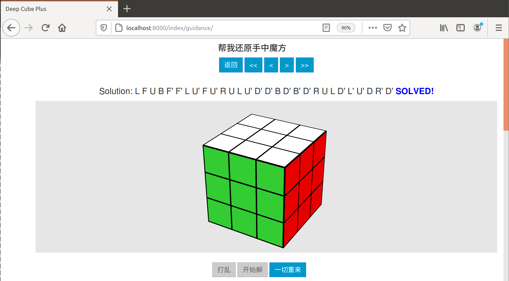
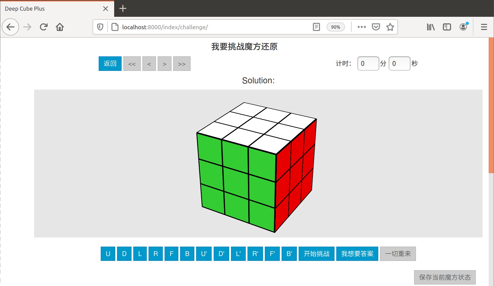
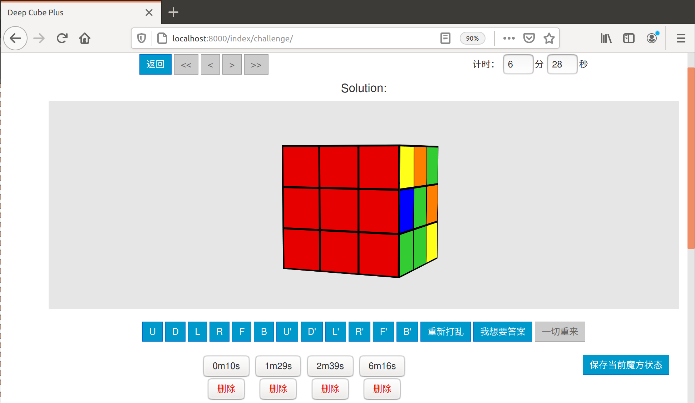

# 魔方辅助学习系统

Refer to https://gitee.com/nwu_hq/cube

[](https://app.travis-ci.com/cs-loafers/cube)

## 1. 项目环境

1. 该项目使用操作系统为 **Linux发行版Ubuntu 16.04**
2. 该项目的运行环境为 **python 2.7**
3. 该项目使用的框架为 **Django 1.11**
4. 项目依赖保存在 *requirement.txt* 文件中。

## 2.项目使用说明

### 1.项目准备

本项目已经基于*Django*框架创建了基本的文件。在项目的根目录下有一个requirement.txt文件，里面保存了项目所需要的运行依赖库。使用以下命令完整依赖的导入。

```bash
cube$ pip install -r requirement.txt
```

此过程需要较长时间，建议使用阿里云镜像库加快下载速度。

换源推荐：https://xiaopengzhen.blog.csdn.net/article/details/102953882

### 2. 项目测试

当完成了准备阶段的依赖导入以后，可以直接运行项目，也可以首先运行测试，检查目前环境配置是否正确。

运行test脚本启动测试：

```bash
cube$ bash test.sh
```

运行后看到以下命令行输出，说明测试通过。



### 3. 项目运行

运行start脚本启动服务，脚本将Django应用映射到本机8000端口。

```bash
cube$ bash start.sh
```

在运行后就能看到以下命令行输出。





在本地浏览器中，我们输入网址：**localhost:8000/index**，就能看到系统主界面。如下图所示


其中包含两个按钮，分别对应了两个界面。

点击**帮我还原手中魔方**按钮，就能对魔方状态进行自由地设置（尤其是在手上有一个需要求解的魔方的时候），得到还原魔方的解决方案，如下图所示。





魔方的平面展开图可以涂色，在3维立体与二维的平面中都能看到效果，还可以在3维魔方中旋转。涂色完成后，点击**开始解**，系统会判断整个魔方是否是可解的，如果可解，给出解决方案，，如图所示，还可以通过图中的左右按钮进行复原过程的查看。。点击**打乱**再**开始解**，可以直接查看求解方案的演示：





点击***返回**退回index主界面，再点击**我要挑战魔方还原**按钮，就能对魔方进行更富有趣味性的求解挑战，如图所示，界面上显示了魔方，一些按钮和计时器。





点击**开始挑战**，计时开始，可以通过下方按钮对魔方进行操作，如下字母表所示：


|  U   |  D   |  L   |  R   |  F   |  B   |
| :--: | :--: | :--: | :--: | :--: | :--: |
|  U'  |  D'  |  L'  |  R'  |  F'  |  B'  |


不同的字母对应不同的操作，比如 **U**对应将以白色方块为中心的面进行顺时针旋转。


在这一过程中，可以随时对自己复原过一部分的魔方状态存储下来，如下图所示。





如果目前的情况完全不满意，可以点击**重新打乱**，魔方将被重新打乱，并且计时器重新开始计时。当无法解出魔方，或想要得到最优的解决方案，点击**我想要答案**得到结果，如图所示。


## 4. 其他

使用（无任何其他配置的）Ubuntu及其原装python2.7，导入项目依赖之前需要安装pip。直接安装python-pip可能出现invalid syntax问题，解决方法：安装新版本pip
wget https://bootstrap.pypa.io/pip/2.7/get-pip.py
python get-pip.py

运行项目时，提示please install the python-tk package，如果没有换国内源，在sudo apt install python时会出现have unmet dependencies问题

在虚拟机中push需要git clone时用git地址而非https地址，否则可能出现connection refused问题
