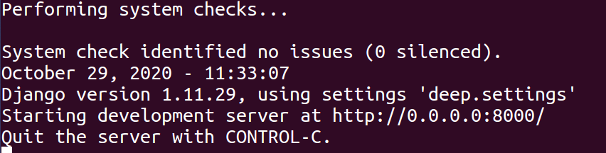

# 魔方项目说明

Refer to https://gitee.com/nwu_hq/cube

## 1. 项目环境

1. 该项目使用操作系统为 **Linux发行版Ubuntu 16.04**
2. 该项目的运行环境为 **python 2.7**
3. 该项目使用的框架为 **Django 1.11**
4. 项目依赖保存在 *requirement.txt* 文件中，下面会有说明。


## 2.项目使用说明

### 1.项目准备

本项目已经基于*Django*框架创建了基本的文件。在项目的根目录下有一个requirements.txt文件，里面保存了项目所需要的运行依赖库。使用以下命令完整依赖的导入。

```bash
cube$ pip install -r requirements.txt
cube$ sudo apt-get install python-tk
```

此过程需要较长时间，建议使用tsinghua镜像库加快下载速度。

conda镜像文件见根目录下/.condarc文件

ubuntu使用命令 gedit/vim ~/.condarc 编辑镜像即可,或者直接复制粘贴也可


### 2. 项目运行

当我们在准备阶段完成了项目依赖的导入以后，我们就可以直接运行我们的项目了，此过程就是*Django*的项目运行过程。

使用以下命令启动服务。需要到Django项目目录下。

```bash
cube$ cd deep 
deep$ python manage.py runserver 0.0.0.0:8000 # 映射到8000端口
```

在运行后就能看到以下命令行输出。



在本地浏览器中，我们输入网址：**localhost:8000/index**，由于在 *urls.py*中没有加入对于 **/** 的映射，所以无法使用 **localhost:8000/** 访问，此网站将显示404错误。

我们就能看到魔方的界面，此界面魔方是一个已经复原的魔方。如下图所示


点击上图的**Scramble**按钮，就能看到一个打乱的魔方。**我们可以在图中旋转我们的魔方**。如下如所示


点击Solve按钮，我们就能看到复原的过程。


我们可以通过图中的左右按钮进行复原过程的查看。


## 3. 项目提高

该项目完成了自动输入魔方的样子，然后能够对给定的魔方样子进行复原。

首先我们还是按照 [项目运行](#2. 项目运行) 的命令启动我们的服务。

此时我们在浏览器中输入以下网址： **localhost:8000/indexPlus**

就能看到以下界面：


其中的**Scramble**和**Solve**与之前的功能相同，我们加入了对魔方的操作，即以下字母表


|  U   |  D   |  L   |  R   |  F   |  B   |
| :--: | :--: | :--: | :--: | :--: | :--: |
|  U'  |  D'  |  L'  |  R'  |  F'  |  B'  |


不同的字母对应不同的操作，比如 **U**对应着将第一行的魔方向左转。

如下图所示


所以我们可以通过按钮或者在文本框中输入我能想要的魔方样子，在3维立体与二维的平面中都能看到效果。**可以在3维魔方中旋转**。如下图所示。


当我们点击 **Solve**按钮，我们可以看到复原过程。如下图：


如之前所述，依旧能够通过魔方上的左右进行过程的查看。


## 4. 其他

Ubuntu下的换源推荐
https://xiaopengzhen.blog.csdn.net/article/details/102953882

运行项目以前下载django
pip install django==1.11 -i https://pypi.tuna.tsinghua.edu.cn/simple

使用Ubuntu原装python2.7，导入项目依赖之前需要安装pip，直接安装python-pip可能出现invalid syntax问题，解决方法：安装新版本pip
wget https://bootstrap.pypa.io/pip/2.7/get-pip.py
python get-pip.py

运行项目时，提示please install the python-tk package，如果没有换国内源，在sudo apt install python时会出现have unmet dependencies问题

在虚拟机中push需要git clone时用git地址而非https地址，否则可能出现connection refused问题
